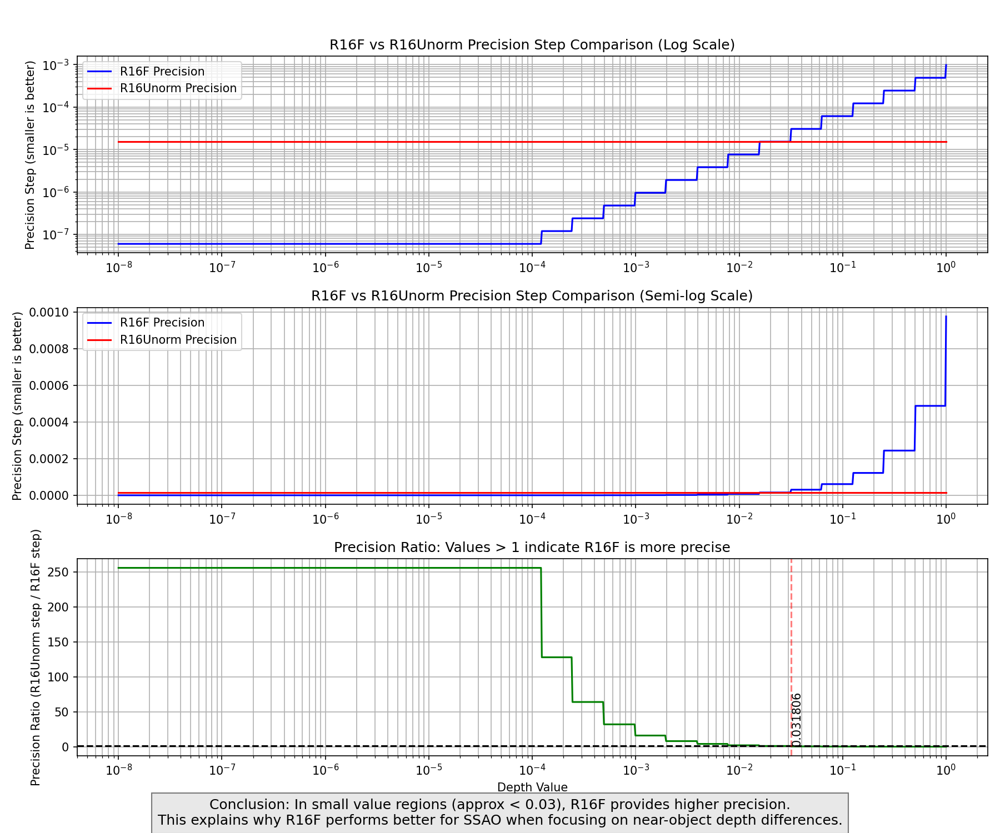
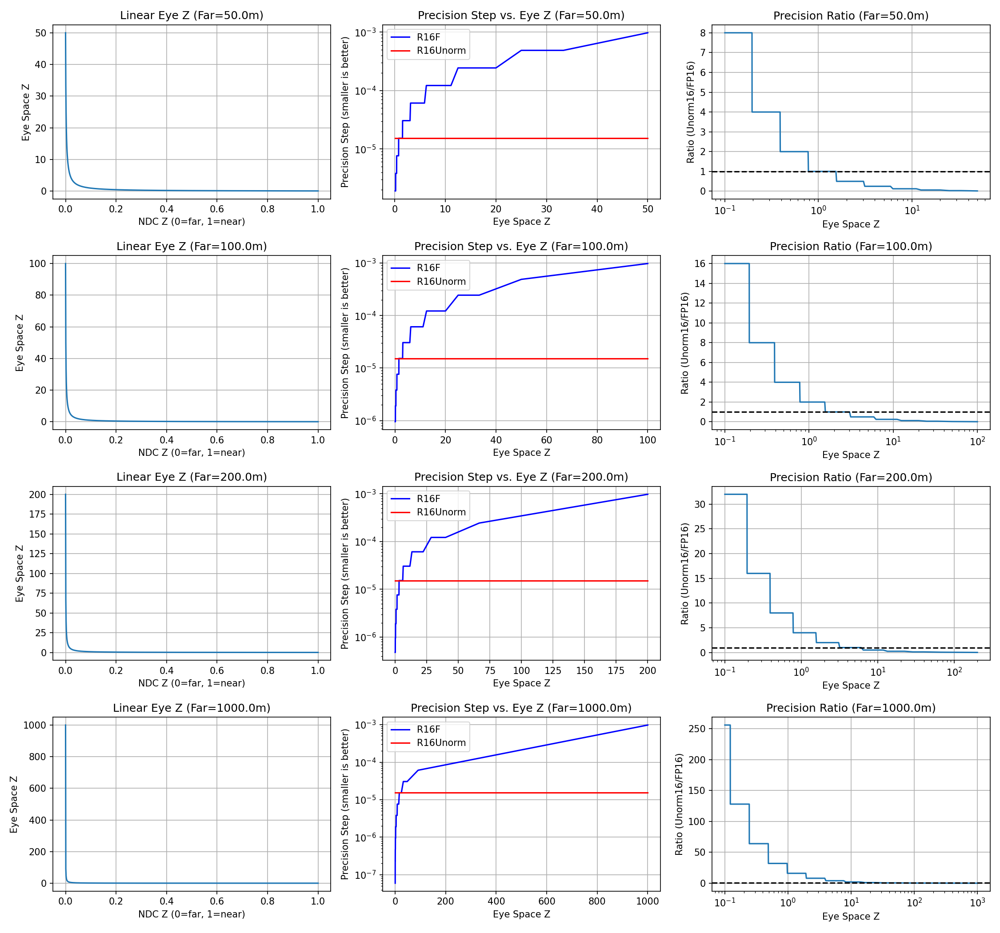
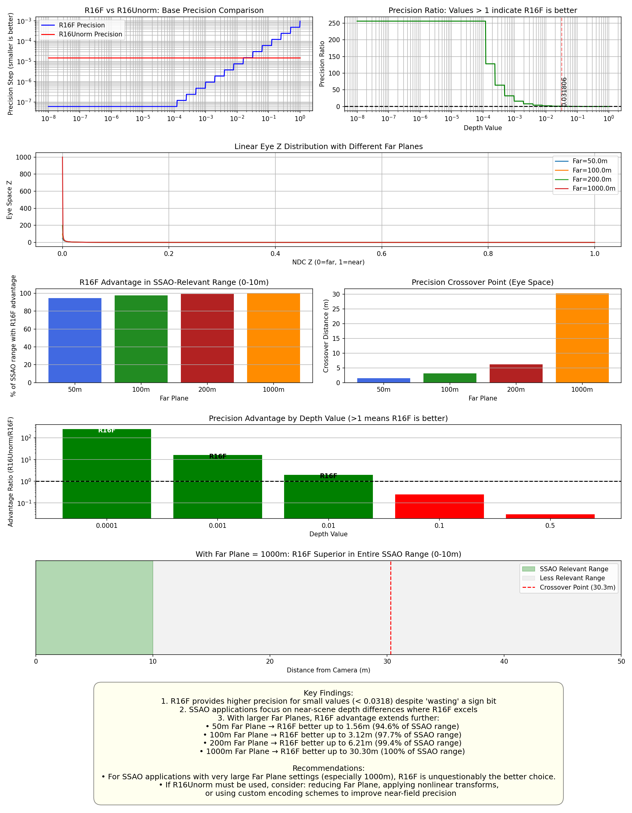

# R16F vs R16Unorm for Depth Storage

This repository contains a comprehensive analysis of precision differences between R16F and R16Unorm formats when storing Linear Eye Depth, with a particular focus on SSAO (Screen Space Ambient Occlusion) applications.

## Key Findings

1. **R16F provides higher precision in small value regions (approx < 0.03)**
   - For normalized depth values less than 0.0318, R16F offers superior precision
   - This advantage is critical for SSAO which primarily focuses on near-depth differences

2. **Far Plane impact is significant**
   - Analysis with 50m, 100m, 200m, and 1000m Far Plane settings shows R16F's advantage increases with Far Plane distance
   - With a 1000m Far Plane, R16F has 100% precision advantage in the entire SSAO-relevant range (0-10m)
   - Precision crossover points: 1.56m (50m Far), 3.12m (100m Far), 6.21m (200m Far), 30.30m (1000m Far)

3. **R16F outperforms despite "wasting" the sign bit**
   - R16F's non-linear precision distribution provides up to 256x higher precision near zero
   - This more than compensates for the theoretical disadvantage of using 1 bit for sign

## Visual Analysis Results

### Basic Precision Comparison

This chart shows the fundamental difference in precision distribution between R16F and R16Unorm formats. Note how R16F provides dramatically higher precision in the small value region (< 0.03), which is critical for SSAO applications.

### Linear Eye Depth Analysis with Various Far Plane Settings

This analysis demonstrates how the precision advantage of R16F extends as the Far Plane increases. With a 1000m Far Plane (bottom row), R16F dominates the entire SSAO-relevant range (0-10m).

### Comprehensive Analysis Summary

This chart summarizes all key findings, showing precision distribution, relative advantage in the SSAO range, and crossover points for different Far Plane settings.

## Detailed Analysis Results

### Precision Comparison Table

| Depth Value | R16F Precision  | R16Unorm Precision | Advantage Ratio | Better Format |
|-------------|-----------------|-------------------|-----------------|---------------|
| 0.0001      | 0.0000000596    | 0.0000152590      | 256.00          | R16F          |
| 0.001       | 0.0000009537    | 0.0000152590      | 16.00           | R16F          |
| 0.01        | 0.0000076294    | 0.0000152590      | 2.00            | R16F          |
| 0.1         | 0.0000610352    | 0.0000152590      | 0.25            | R16Unorm      |
| 0.5         | 0.0004882812    | 0.0000152590      | 0.03            | R16Unorm      |

### SSAO-Relevant Depth Range Analysis

For SSAO-relevant near-depth ranges (0-10m):

| Far Plane | R16F Better | R16Unorm Better | Precision Crossover |
|-----------|-------------|-----------------|---------------------|
| 50m       | 94.6%       | 5.4%            | 1.56m               |
| 100m      | 97.7%       | 2.3%            | 3.12m               |
| 200m      | 99.4%       | 0.6%            | 6.21m               |
| **1000m** | **100.0%**  | **0.0%**        | **30.30m**          |

## Analysis Conclusions

1. **R16F's theoretical disadvantage is misleading**:
   - Although R16F "wastes" one bit on sign (leaving 15 bits for value vs R16Unorm's 16 bits), its non-linear precision distribution more than compensates in the critical range for SSAO applications
   - For SSAO applications focusing on near-scene depth differences, the extra precision near zero is far more valuable than uniform precision across the entire range

2. **Far Plane setting critically affects the choice**:
   - Larger Far Plane settings increasingly favor R16F
   - With a 1000m Far Plane, there is no scenario where R16Unorm outperforms R16F in the SSAO-relevant range

3. **Practical implications**:
   - SSAO quality will be visibly better with R16F compared to R16Unorm when using large Far Plane settings
   - Performance will be identical as both formats use 16 bits of memory

## Recommendations

1. **For SSAO applications with very large Far Plane settings (especially 1000m)**, R16F is unquestionably the better choice.

2. If R16Unorm must be used, consider:
   - Reducing the Far Plane value (if possible)
   - Applying a non-linear transformation (like square root) to redistribute precision
   - Using a custom encoding/decoding scheme to improve near-field precision

## Repository Structure

### Markdown Reports
- `README.md` - This file, containing a complete analysis summary with visualizations
- `depth_precision_report.md` and `depth_precision_report_en.md` - Initial analysis reports
- `depth_precision_report_with_1000m.md` and `depth_precision_report_with_1000m_en.md` - Updated reports including 1000m Far Plane

### Analysis Files Directory (`analysis_files/`)
- **Python Scripts**
  - `depth_precision_analysis.py` - Basic comparison of R16F vs R16Unorm precision
  - `depth_precision_analysis_en.py` - English version of basic comparison
  - `eye_depth_analysis.py` - Analysis of Linear Eye Depth with various Far Plane settings
  - `generate_summary_report.py` - Comprehensive analysis and report generation

- **Visualization Charts**
  - `depth_precision_comparison.png` and `depth_precision_comparison_en.png` - Basic precision comparison
  - `eye_depth_analysis.png` - Linear Eye Depth analysis with standard Far Planes
  - `eye_depth_analysis_with_1000m.png` - Linear Eye Depth analysis including 1000m Far Plane
  - `depth_precision_summary.png` - Comprehensive results visualization
  - `depth_precision_summary_with_1000m.png` - Comprehensive results including 1000m Far Plane

- **HTML Reports**
  - `depth_format_analysis_report.html` - HTML report of initial findings
  - `depth_format_analysis_report_with_1000m.html` - HTML report including 1000m Far Plane analysis

- **Dependencies**
  - `requirements.txt` - Python dependencies for running the analysis scripts 